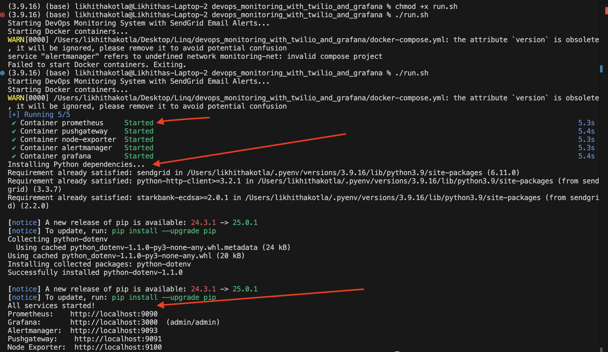

# DevOps Monitoring & Alerting Assessment

## Architecture Summary

This project sets up a complete **Monitoring + Alerting** solution using Prometheus, Grafana, and SendGrid webhook-based alerting.

**Components in Containers:**
- **Node Exporter**: Provides host metrics 
- **Pushgateway**: Accepts metrics from short-lived scripts (In our architecture the metrics comes from python simulator code and node exporter)
- **Prometheus**: Stores and evaluates metrics
- **Alertmanager**: Sends notifications based on alert rules
- **Grafana**: Visualizes metrics through dashboards

**Custom Scripts:**
- **metrics_simulator.py**: Simulates metrics (CPU, memory, disk, network) (just using for this project to get clear results or else any application code can be used and node exporter can be used for real time CPU, Memory, disk matrices) 
- **twilio_alert_webhook.py**: Flask server for receiving webhook alerts
- **sendgrid_config.py**: SendGrid setup for API email delivery
- **run.sh**: Orchestrates startup of all services and installs all dependencies (like prometheus_client, flask, sendgrid and python-dotenv) needed.

**Key Files:**
| File | Purpose |
|------|---------|
| `docker-compose.yml` | Spins up Prometheus, Grafana, Pushgateway, Node Exporter, Alertmanager |
| `prometheus.yml` | Defines scrape jobs for Prometheus |
| `alert.rules.yml` | Prometheus alert rules configuration |
| `system_alert_dashboard.json` | Grafana dashboard for visualizing metrics |
| `alertmanager.yml` | Routes alerts to SendGrid webhook |
| `metrics_simulator.py` | Python script to simulate and push metrics |
| `twilio_alert_webhook.py` | Receives webhooks and logs/email alerts |
| `sendgrid_config.py` | SendGrid API key configuration |
| `run.sh` | Script to start containers and install dependencies |

---
## Architecture Diagram


                 ┌──────────────────────────────┐
                 │    Python Simulator          │
                 │ (metrics_simulator.py)       |
                 |and/or Node exporter          │
                 └────────────┬─────────────────┘
                              │
                              ▼
                 ┌──────────────────────────────┐
                 │      Prometheus PushGateway  │
                 └────────────┬─────────────────┘
                              │
                              ▼
                 ┌──────────────────────────────┐
                 │          Prometheus          │
                 │ (Scrapes metrics & triggers  │
                 │  alerts based on rules)      │
                 └──────┬──────────┬────────────┘
                        │          │
                        │          ▼
                        │  ┌────────────────────┐
                        │  │   Grafana          │
                        │  │ (Dashboards only)  │
                        │  └────────────────────┘
                        ▼
        ┌────────────────────────────────────┐
        │         Alertmanager               │
        │ (Receives alerts from Prometheus  │
        │  and routes to webhook/email/SMS) │
        └────────────────────┬──────────────┘
                             ▼
                ┌────────────────────────────┐
                │   Flask Webhook Server     │
                │ (twilio_alert_webhook.py)  │
                └────────────┬───────────────┘
                             ▼
                 Sends Email via SendGrid API


## Part 1: Monitoring Design

### Metrics Monitored
The following system-level metrics are continuously tracked and are simulated by metrics_simulator python script:

- **CPU Usage (%)** – Measures processing load  
- **Memory Usage (%)** – Indicates system memory consumption  
- **Disk Usage (%)** – Observes available vs. used disk space on root mount (`/`)  
- **Load Average (1-minute)** – Tracks system load over the last 1 minute  
- **Node Status (Up/Down)** – Verifies if node-exporter is active and reachable

---

### Tools / Scripts Used for Metric Collection

| Tool / Script              | Purpose                                                                 |
|---------------------------|-------------------------------------------------------------------------|
| `node-exporter`           | Collects real-time system metrics from the host machine  (In this project we are generating some fake metrics from metrics simulator code so node exporter is used only in some cases and it will be discussed below)               |
| `metrics_simulator.py`    | Simulates CPU, memory, disk, load, and network metrics for testing      |
| `pushgateway`             | Stores metrics pushed from short-lived scripts before Prometheus pulls |


**Bonus:** All components (Prometheus, Grafana, Node Exporter, PushGateway, Alertmanager) are defined in the `docker-compose.yml` file and can be launched together via `run.sh`.

---

### Backend Storage Solution

- **Prometheus** is used as the core time-series database and metrics collector.  
- It scrapes data from `node-exporter` and `Pushgateway`.  
- All metrics are stored, visualized in Grafana, and evaluated for alerting rules using `prometheus.yml` and `alert.rules.yml`.

## Part 2: Alerting

This section outlines the alerting strategy implemented using **Prometheus Alertmanager**, a **Python webhook server**, and **SendGrid email integration**.

### Alerting Strategy

- Alerts are triggered based on custom thresholds for each metric.
- Prometheus continuously evaluates conditions using **PromQL**.
- Alerts are grouped and routed to a **webhook receiver** (running on Flask) which then sends email alerts using the **SendGrid API**.

---

### Alert Rules Configuration

Defined in `alert.rules.yml` and mounted into Prometheus:

| **Alert Name**        | **Condition (PromQL Expression)**                                                                 | **For Duration** | **Severity** | **Summary**                         |
|-----------------------|--------------------------------------------------------------------------------------------------|------------------|--------------|-------------------------------------|
| HighCPUUsage          | `custom_cpu_usage > 70`                                                                           | 2 minutes        | Critical     | High CPU usage detected             |
| HighMemoryUsage       | `custom_memory_usage > 50`                                                                        | 2 minutes        | Warning      | High Memory usage detected          |
| LowDiskSpace          | `(node_filesystem_avail_bytes{mountpoint="/"} / node_filesystem_size_bytes{mountpoint="/"}) < 0.1` | 5 minutes        | Warning      | Low disk space                      |
| NodeDown              | `up{job="node-exporter"} == 0`                                                                    | 1 minute         | Critical     | Node exporter is down               |
| HighLoadAverage       | `node_load1 > 2`                                                                                  | 2 minutes        | Warning      | High 1-minute load average          |
| HighNetworkTraffic    | `rate(node_network_receive_bytes_total[1m]) > 100000000`                                          | 1 minute         | Info         | High inbound network traffic        |

---

### Alert Delivery: Email via SendGrid

- **Webhook URL:** `http://localhost:5001/` (Flask server endpoint)
- **SendGrid API** is used to send email notifications for active alerts.
- Alerts include detailed annotations (`summary`, `description`) parsed by the webhook script and sent via email.

---

### Grafana Color Thresholds

For better visualization, each panel is configured with color-coded thresholds in the dashboard JSON (`system_alert_dashboard.json`):

| **Metric**               | **Green** | **Orange** | **Red** |
|--------------------------|-----------|------------|---------|
| CPU Usage (%)            | `< 70`    | `70 - 90`  | `> 90`  |
| Memory Usage (%)         | `< 50`    | `50 - 90`  | `> 90`  |
| Disk Available (%)       | `> 30`    | `15 - 30`  | `< 15`  |
| Node Exporter Status     | `1` (Up)  | —          | `0` (Down) |
| Load Average (1 min)     | `< 1`     | `1 - 2`    | `> 2`   |
| Network Inbound (Bps)    | `< 50MB/s`| `50-100MB/s`| `> 100MB/s` |

These visual thresholds make it easy to monitor system health at a glance.

### Metric Sources Clarification

In this monitoring setup, different metrics displayed in Grafana are sourced from either the **custom Python simulator** or **Node Exporter**, and in some cases, **both**:

- **CPU Usage (%), Memory Usage (%), and Disk Space Available (%)** are **simulated** using the `metrics_simulator.py` script.
- **Node Exporter Status (Up/Down)** is **exclusively scraped from Node Exporter**, which is why it must be running if this metric is enabled.
- **Network Inbound Traffic (Bytes/sec)** and **1 Minute Load Average** are provided by **both** the **simulator** and **Node Exporter**.
  - As a result, **you may see two separate lines/graphs** in the Grafana dashboard for these panels — one from each data source.

---

## How Does Your Design Scale with Increased Servers or Monitoring Requirements?

### Answer:

To support scalability:

- I will **containerize my application** along with all key monitoring components — `Prometheus`, `Grafana`, `PushGateway`, `Node Exporter`, and `AlertManager`.
- I will **deploy the entire stack on Kubernetes**, where:
  - Each service and the application will run inside individual **Pods**.
  - **Prometheus** will scrape metrics from all pods or nodes in the cluster.
  - Kubernetes’ **Horizontal Pod Autoscaler (HPA)** will scale the application and services automatically based on CPU usage or custom metrics.
  - **Helm Charts** or **Kubernetes Deployments** will allow easy scaling, reproducibility, and management.

### Benefits of This Design:

- **Self-healing**: Failed containers are restarted automatically.
- **Scalable**: Easily add new monitoring targets or replicas.
- **Flexible**: Add more nodes or services without modifying the monitoring setup.


This Kubernetes-based architecture ensures that both the application and monitoring stack scale seamlessly with infrastructure growth.

____

---

## Run Instructions

Follow the steps below to set up and run the monitoring system locally:

### 1. Clone the Repository

```bash
git clone https://github.com/likhithakotla/devops_monitoring_with_twilio_and_grafana.git
cd devops_monitoring_with_twilio_and_grafana
```

### 2. Add the `.env` File

- Add the .env file before running:

- Fill in the required environment variables in `.env`, before doing this get the api and verify email in sendgrid application. The step up is given in additional info below:

```env
SENDGRID_API_KEY=your_actual_sendgrid_api_key
FROM_EMAIL=your_verified_sender@example.com
TO_EMAIL=recipient@example.com
```

### 3. Run the `run.sh` Script

- Make the script executable (if not already):

```bash
chmod +x run.sh
```
- Execute it to start all Docker containers:

```bash
./run.sh
```

This will spin up the following services using Docker:
- Prometheus
- Grafana
- AlertManager
- Node Exporter
- PushGateway



### 4. Run Python Scripts

- Open **two terminal windows**:
  - **Terminal 1**: Start the metric simulator

```bash
python3 metrics_simulator.py
```


  - **Terminal 2**: Start the SendGrid webhook server

```bash
python3 twilio_alert_webhook.py
```


### 5. (Optional) Run Webhook in Production Mode

If deploying in production, use Gunicorn:

```bash
pip install gunicorn
gunicorn -w 4 -b 0.0.0.0:5001 twilio_alert_webhook:app
```

### 6. Access Prometheus

- URL: [http://localhost:9090](http://localhost:9090)
- Navigate to the **Alerts** tab to view active alerts.


### 7. Access Grafana Dashboards

- URL: [http://localhost:3000](http://localhost:3000)
- Login:
  - Username: `admin`
  - Password: `admin`
- View and explore:
  - CPU Usage
  - Memory Usage
  - Disk Space
  - Node Status
  - Load Average
  - Network Traffic


### 8. Alerts to Email
- If threshold is reached alerts are generated to with the email subject and message as shown. 


### 9. Stop running containers after execution
- Run docker-compose down
---

## 📋 Conclusion

This setup demonstrates a **production-ready**, **containerized Monitoring & Alerting system** using:

- **Prometheus** for metric collection and alert evaluation  
- **Grafana** for real-time visualization  
- **Alertmanager** for routing alerts  
- **SendGrid** for email-based alert notifications

It enables real-time **metric collection**, **dashboard monitoring**, and **custom alerting** via email.

The system is fully **Dockerized** and **Kubernetes-ready**, making it suitable for **scalable infrastructure** and **cloud-native deployments**.

_________

## Additional Info: SendGrid Email Setup

To enable email alerting via SendGrid, follow the steps below:

### SendGrid Setup Steps

1. **Create a SendGrid Account**  
   - Visit [https://sendgrid.com](https://sendgrid.com) and sign up for a free account.

2. **Generate an API Key**  
   - Go to **Settings > API Keys**  
   - Click **Create API Key**
     - Give it a name like `PrometheusAlertsKey`
     - Choose **Full Access**
   - Click **Create & Copy** the key.

3. **Configure the API Key, from email and to email in Project**  
   - Create a `.env` file in your project root (if not already present).
   - Add the following lines:
     ```env
     SENDGRID_API_KEY=your_actual_sendgrid_api_key
     FROM_EMAIL=your_verified_sender@example.com
     TO_EMAIL=recipient_email@example.com
     ```

4. **Verify Sender Identity (Required by SendGrid)**  
   - Go to **Settings > Sender Authentication** on SendGrid Dashboard.
   - Add and verify the **From Email Address** (`FROM_EMAIL`) used above.
   - You will receive a verification email — make sure to confirm it before testing alerts.

Once setup is complete, the webhook server (`twilio_alert_webhook.py`) will use these credentials to send alert emails for active Prometheus alerts.

---
